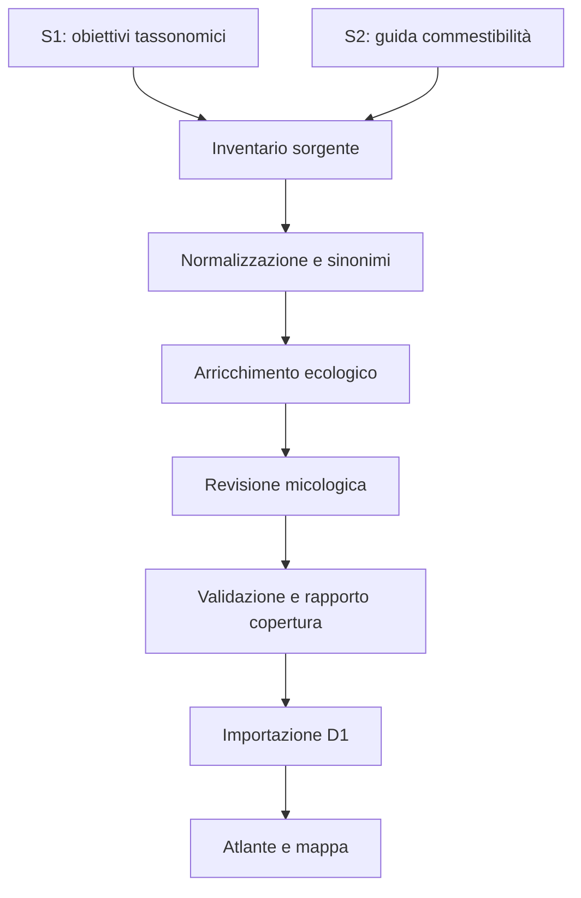

# Catalogo micologico nazionale — Specifica formale

**Stato:** approvato dall'utente il 16 settembre 2026
**Data:** 16 settembre 2026  
**Prodotto:** Fungo Italia — Beta  
**Matrice campi:** `docs/catalog/catalog-field-matrix.md`

## 1. Scopo

Il catalogo sostituisce l'elenco dimostrativo della beta con una base dati nazionale, versionata e verificabile. Deve rappresentare senza falsa precisione tutti i taxa compresi nel perimetro approvato, mantenendo distinti tassonomia, obiettivi didattici, commestibilità, ecologia, fenologia, distribuzione, associazioni e sicurezza.

Il catalogo serve contemporaneamente a:

1. ricerca per nome scientifico, sinonimo, nome italiano e nome regionale;
2. formazione del raccoglitore e preparazione del micologo;
3. supporto prudente alla ricerca sul territorio;
4. classificazione preliminare delle osservazioni fotografiche;
5. assegnazione delle verifiche a micologi per territorio e gruppo tassonomico;
6. alimentazione motivata del punteggio delle aree, senza rivelare punti di raccolta.

## 2. Fonti vincolanti

### S1 — Obiettivi tassonomici

**Titolo:** *Obiettivi tassonomici nella formazione dei micologi: livello minimo, livello auspicabile e approfondimenti facoltativi*  
**Versione:** V4, 09.06.2026  
**Uso:** determina inclusione, rango e risoluzione didattica richiesta; segnala i taxa per i quali è necessaria conoscenza morfologica approfondita.

### S2 — Commestibilità

**Citazione:** Sitta N., Davoli P., Floriani M. & Suriano E. (2021), *Guida ragionata alla commestibilità dei funghi. Revisione critica della letteratura micotossicologica e biochimica e analisi della casistica del Centro Antiveleni di Milano*  
**Uso:** unica fonte primaria del catalogo per la categoria di commestibilità e per i trattamenti alimentari associati.

### Fonti complementari

Nomenclatura corrente, distribuzione, altitudine, fenologia, habitat e associazioni richiedono fonti ulteriori, registrate una per una. Le fonti complementari non possono modificare il perimetro di S1 né la categoria alimentare di S2. Ogni conflitto viene conservato come tale e inviato a revisione micologica.

## 3. Regola di inclusione

Un'entità tassonomica entra nel catalogo pubblicabile quando soddisfa almeno una delle condizioni seguenti:

- è una famiglia, genere, sezione, gruppo, aggregato o specie esplicitamente indicata come obiettivo minimo in S1;
- è un taxon cui S1 associa la dicitura “conoscenza morfologica approfondita” all'interno degli obiettivi minimi;
- è un taxon esplicitamente valutato in S2, indipendentemente dalla categoria alimentare.

I taxa auspicabili o facoltativi di S1 vengono acquisiti nel registro sorgente, ma restano separati mediante `publicationTier = expansion` finché non vengono inclusi in una fase approvata.

### 3.1 Rango e precisione

- Se S1 richiede il riconoscimento del genere, viene creato il record del genere; non vengono aggiunte automaticamente tutte le specie italiane del genere.
- Se S1 nomina specie, sezioni o gruppi all'interno del genere, si creano anche i relativi record.
- Le diciture `s.l.`, `s.str.`, `gr.`, `agg.`, `sect.` e complessi di specie vengono mantenute come unità tassonomiche operative.
- Una categoria di S2 assegnata a un gruppo non viene propagata alle singole specie senza una valutazione esplicita.
- Il nome riportato dalla fonte viene conservato in `sourceTaxonLabel`; la riconciliazione con il nome accettato non lo sostituisce né lo nasconde.

## 4. Principi del modello

### 4.1 Entità separate

Il catalogo è composto da entità normalizzate:

- `Taxon`: identità tassonomica canonica;
- `TaxonName`: nomi scientifici, comuni e regionali;
- `TrainingObjective`: obiettivo didattico derivato da S1;
- `EdibilityAssessment`: valutazione alimentare derivata da S2;
- `EcologyProfile`: strategia trofica, habitat, suolo e substrato;
- `OrganismAssociation`: legame con alberi, piante, funghi o altri organismi;
- `PhenologyProfile`: periodo di crescita per area e quota;
- `GeographicProfile`: presenza e rilevanza territoriale;
- `ConfusionRelation`: taxa confondibili e gravità;
- `Source`: descrizione bibliografica o documentale;
- `Evidence`: collegamento puntuale tra un'affermazione e una fonte;
- `CatalogRelease`: versione pubblicata del catalogo e rapporto di copertura.

### 4.2 Nessun dato senza provenienza

Commestibilità, fenologia, distribuzione, fascia altitudinale, habitat, associazioni e confusioni devono avere almeno una `Evidence`. Le affermazioni prive di fonte restano nello stato `draft` e non vengono mostrate come fatti.

### 4.3 Testo sintetico originale

Il catalogo non riproduce estesi testi protetti. Registra dati strutturati, categorie, condizioni, riferimenti puntuali e sintesi originali. Le citazioni testuali, se indispensabili, devono essere brevi e attribuite.

## 5. Tassonomia e nomenclatura

### 5.1 Identificatore stabile

`taxonId` è un identificatore interno immutabile e indipendente dal nome corrente. Un cambio nomenclaturale aggiorna il nome accettato e crea o aggiorna una relazione sinonimica senza cambiare l'identità dei record collegati.

### 5.2 Rango operativo

Valori ammessi:

`family`, `genus`, `subgenus`, `section`, `subsection`, `speciesGroup`, `aggregate`, `species`, `subspecies`, `variety`, `operationalGroup`.

`operationalGroup` viene usato soltanto quando una fonte adotta un raggruppamento didattico o alimentare non coincidente con un rango nomenclaturale formale.

### 5.3 Stato del nome

Valori ammessi:

`accepted`, `synonym`, `formerCombination`, `misapplied`, `sourceLiteral`, `unresolved`.

Un nome `unresolved` blocca l'approvazione scientifica del taxon, ma non ne impedisce l'inventario sorgente.

### 5.4 Nomi volgari

Ogni nome comune viene registrato con lingua, tipo, territorio e fonte. Lo stesso nome può riferirsi a taxa diversi: `ambiguityStatus = ambiguous` rende visibile l'avvertenza e impedisce di usarlo come identificatore univoco.

## 6. Obiettivi tassonomici

Ogni `TrainingObjective` specifica:

- livello: `minimum`, `desirable`, `optional`;
- risoluzione richiesta: famiglia, genere, sezione, gruppo, aggregato o specie;
- `deepMorphologyRequired`;
- eventuale ambito territoriale indicato in S1;
- criticità: `ordinary`, `importantEdible`, `importantToxic`, `deadlyRisk`;
- pagina e formulazione sorgente sintetizzata.

Il livello mostrato al pubblico viene tradotto senza perdere il valore tecnico:

| Valore tecnico | Etichetta pubblica |
|---|---|
| `minimum` | Essenziale |
| `minimum` + morfologia approfondita | Taxon critico |
| `desirable` | Approfondimento |
| `optional` | Specialistico |

## 7. Commestibilità

### 7.1 Categorie ammesse

I soli valori pubblicabili sono:

| Codice | Etichetta |
|---|---|
| `EDIBLE` | Commestibile |
| `EDIBLE_AFTER_TREATMENT` | Commestibile dopo trattamenti |
| `DISCOURAGED` | Sconsigliato |
| `NO_FOOD_VALUE` | Privo di valore alimentare |
| `NOT_EDIBLE` | Non commestibile |
| `POISONOUS` | Velenoso o tossico |
| `NOT_ASSESSED` | Non valutato nella Guida ragionata |

`NOT_ASSESSED` è uno stato di copertura, non una valutazione alimentare.

### 7.2 Ambito della valutazione

`assessmentScope` specifica se la valutazione riguarda esattamente il taxon, un gruppo, una sezione o un insieme definito dalla fonte. Le eccezioni vengono registrate in record separati. L'interfaccia deve indicare esplicitamente “valutazione riferita al gruppo” quando applicabile.

### 7.3 Trattamenti

I trattamenti vengono registrati come istruzioni strutturate e testo sintetico:

`completeCooking`, `boilingAndDiscardWater`, `removeParts`, `youngSpecimensOnly`, `avoidAfterFreezing`, `avoidAlcohol`, `quantityLimit`, `otherSpecified`.

La presenza di un trattamento non sostituisce il controllo micologico e non costituisce autorizzazione al consumo.

## 8. Ecologia, associazioni e indicatori

### 8.1 Strategia trofica

Valori multipli ammessi:

`ectomycorrhizal`, `saprotrophicTerrestrial`, `saprotrophicLignicolous`, `parasitic`, `necrotrophic`, `coprophilous`, `bryophilous`, `lichenized`, `mixed`, `unknown`.

### 8.2 Habitat

Gli habitat usano un vocabolario controllato gerarchico. Il livello pubblico comprende almeno:

- faggeta;
- castagneto;
- querceto deciduo;
- lecceta e sughereta;
- pioppeto e saliceto;
- ontaneta e ambiente ripariale;
- abetina ad abete bianco;
- pecceta ad abete rosso;
- pineta mediterranea;
- pineta montana;
- bosco misto;
- prato, pascolo e prato arborato;
- macchia mediterranea;
- ambiente urbano o antropizzato;
- legno morto, ceppaia o radice;
- area bruciata o fortemente disturbata.

### 8.3 Relazioni biologiche

`OrganismAssociation.relationType` distingue:

- `confirmedMycorrhiza`;
- `probableMycorrhiza`;
- `hostPreference`;
- `growthSubstrate`;
- `parasiticHost`;
- `sharedHabitat`;
- `phenologicalCooccurrence`;
- `empiricalIndicator`;
- `traditionalIndicator`;
- `negativeIndicator`.

Gli indicatori empirici e tradizionali non vengono mai descritti come rapporti causali o come garanzia di ritrovamento. Una relazione tra due funghi è separata da una relazione fungo–pianta.

### 8.4 Attendibilità

Valori ammessi:

`documented`, `strong`, `moderate`, `indicative`, `traditional`, `uncertain`.

Solo `documented`, `strong` e `moderate` possono concorrere al futuro punteggio delle aree. Gli indicatori `traditional` vengono mostrati esclusivamente come nota educativa.

## 9. Fenologia

La fenologia non è un singolo periodo nazionale. Ogni `PhenologyProfile` associa un taxon a:

- zona geografica;
- fascia altitudinale;
- mesi tipici;
- mesi possibili;
- eventuali condizioni antecedenti;
- livello di confidenza;
- fonte.

### 9.1 Zone

Valori ammessi:

`italyGeneral`, `alpsWest`, `alpsCentral`, `alpsEast`, `poPlain`, `prealps`, `northernApennines`, `centralApennines`, `southernApennines`, `tyrrhenian`, `adriatic`, `mediterranean`, `sicily`, `sardinia`.

### 9.2 Fasce altitudinali

Il catalogo conserva quote numeriche minime, massime e ottimali quando la fonte le sostiene. L'interfaccia deriva inoltre le etichette:

- planiziale: 0–300 m;
- collinare: 300–700 m;
- montana: 700–1.500 m;
- montana superiore: 1.500–2.000 m;
- subalpina/alpina: oltre 2.000 m.

Le etichette non sostituiscono le quote sorgente e possono sovrapporsi in aree biogeografiche differenti.

## 10. Geografia

`GeographicProfile` distingue macroarea, regione amministrativa, sistema montuoso e stato della presenza.

Valori di presenza:

`widespread`, `common`, `localized`, `rare`, `historical`, `uncertain`, `notDocumented`.

Nord, Centro e Sud vengono derivati dalle regioni mediante una tabella pubblica e versionata; non sono memorizzati come unico dato primario. Alpi e Appennini sono campi indipendenti perché attraversano più regioni.

## 11. Confusioni e sicurezza

Ogni `ConfusionRelation` collega due taxa e registra:

- direzione della confusione;
- caratteri che possono indurre errore;
- caratteri discriminanti;
- rischio: `low`, `moderate`, `high`, `deadly`;
- necessità di mostrare un avviso prioritario;
- fonte.

Le schede con rischio `deadly` mostrano l'avviso prima di qualsiasi informazione alimentare.

## 12. Provenienza e revisione

### 12.1 Evidence

Ogni affermazione sensibile è collegata a una o più evidenze con:

- `sourceId`;
- pagina, tabella o sezione;
- sintesi dell'affermazione;
- forza dell'evidenza;
- curatore;
- data di estrazione e revisione.

### 12.2 Stato di revisione

Valori ammessi:

`extracted`, `normalized`, `reviewNeeded`, `reviewed`, `approved`, `superseded`, `rejected`.

Solo i record `approved` sono usati per commestibilità e avvisi di sicurezza. I dati ecologici `reviewed` possono essere pubblicati con livello di confidenza visibile; i dati `reviewNeeded` rimangono esclusi.

### 12.3 Competenza del revisore

La revisione registra regione e gruppo tassonomico di competenza. Un revisore non può approvare il proprio contributo quando il dato riguarda commestibilità, tossicità o una confusione ad alto rischio.

## 13. Architettura dei dati

### 13.1 Sorgente versionata

I dati curati vivono nel repository in file strutturati separati per responsabilità:

```text
data/catalog/
  sources.json
  taxa.json
  names.json
  training-objectives.json
  edibility-assessments.json
  ecology-profiles.json
  organism-associations.json
  phenology-profiles.json
  geographic-profiles.json
  confusion-relations.json
  evidence.json
  releases.json
```

I file sono validati prima dell'importazione. D1 è il database di lettura e ricerca del sito, non la fonte editoriale primaria.

### 13.2 Pipeline



### 13.3 Rilasci

Ogni `CatalogRelease` contiene:

- versione semantica;
- data;
- hash dei file sorgente;
- numero di taxa per fonte, rango e stato;
- percentuale di copertura della commestibilità;
- numero di record in revisione;
- elenco dei conflitti bloccanti;
- revisori.

## 14. Interfaccia

### 14.1 Ricerca

La ricerca interroga nome accettato, sinonimi, combinazioni precedenti, nome nazionale e nomi regionali. Il risultato mostra sempre nome comune principale, nome scientifico e rango operativo.

### 14.2 Filtri

- macrogruppo e famiglia;
- rango;
- livello didattico;
- categoria alimentare;
- mese;
- zona geografica;
- regione;
- fascia altitudinale;
- habitat;
- essenza arborea o substrato;
- strategia trofica;
- stato di revisione.

### 14.3 Scheda taxon

Ordine obbligatorio:

1. identità e rango;
2. avvisi critici;
3. obiettivo di riconoscimento;
4. caratteri essenziali e taxa confondibili;
5. dove e quando;
6. associazioni e indicatori;
7. commestibilità e condizioni;
8. nomi regionali;
9. fonti e stato della revisione.

Se la scheda rappresenta un gruppo o aggregato, un'etichetta persistente comunica che non è una determinazione a specie.

## 15. Validazioni bloccanti

La pubblicazione fallisce se si verifica almeno uno dei casi seguenti:

- taxon nel perimetro senza record canonico;
- record canonico privo di rango o genitore quando richiesto;
- nome scientifico sorgente non conservato;
- obiettivo minimo senza riferimento a pagina/sezione di S1;
- categoria alimentare diversa da `NOT_ASSESSED` senza evidenza S2;
- valutazione di gruppo propagata implicitamente a specie;
- trattamento richiesto senza testo sintetico e fonte;
- fenologia senza zona o fonte;
- nome regionale senza territorio;
- associazione senza tipo, attendibilità o evidenza;
- indicatore empirico descritto come micorriza;
- confusione ad alto rischio priva di caratteri discriminanti;
- record approvato privo di revisore e data;
- identificatore duplicato o sinonimo collegato a più taxa senza dichiarazione di ambiguità.

## 16. Rapporto di copertura

Il processo di importazione produce una matrice di audit con una riga per ogni voce delle fonti e almeno queste colonne:

`source`, `sourceLocation`, `sourceTaxonLabel`, `resolvedTaxonId`, `rank`, `scope`, `objectiveLevel`, `edibilityCategory`, `normalizationStatus`, `reviewStatus`, `publicationStatus`, `notes`.

Il catalogo non può essere dichiarato completo finché tutte le righe S1-minimo e S2 non risultano `resolved` oppure `blocked` con motivazione esplicita e revisione micologica.

## 17. Sequenza di realizzazione

1. estrazione separata di S1 e S2;
2. inventario letterale e rapporto di copertura iniziale;
3. riconciliazione tassonomica senza perdita dei nomi sorgente;
4. revisione delle categorie alimentari e dei trattamenti;
5. arricchimento ecologico, geografico e fenologico con fonti complementari;
6. revisione micologica per competenza;
7. generazione dei file catalogo e validazione;
8. importazione D1 e indici di ricerca;
9. nuova interfaccia Atlante;
10. test, pubblicazione privata e aggiornamento GitHub.

## 18. Criteri di accettazione

- copertura documentata del 100% delle voci S1-minimo e S2;
- nessuna categoria alimentare non riconducibile a S2;
- nessuna promozione automatica da genere o gruppo a specie;
- ricerca funzionante per nomi accettati, sinonimi e nomi regionali;
- schede di gruppo chiaramente distinguibili dalle schede di specie;
- periodo, habitat, geografia e indicatori accompagnati da fonte e confidenza;
- test automatici per schema, vocabolari, copertura, riferimenti e conflitti;
- rilascio riproducibile dal repository;
- avvertenza alimentare sempre visibile nelle schede interessate.
